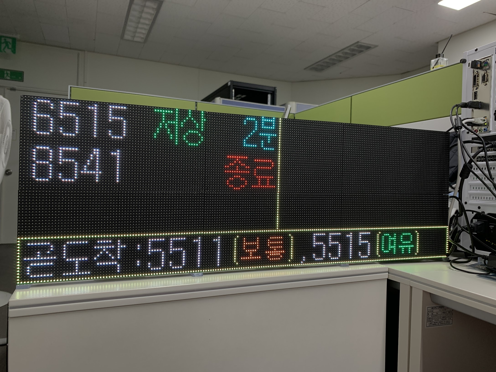

# LED bus panel
* 서울 버스 전광판 제작용 파일
* 제작과정: [https://atik.kr/2021/05/bus-panel/](https://atik.kr/2021/05/bus-panel/)



---

## Bill of materials
### Parts
* 6 * P4 RGB LED panels (64x32pixels, 256x128mm)
* A Raspberry Pi 4
* [Adafruit RGB matrix HAT](https://www.adafruit.com/product/2345)
* A 5V, >150W(>30A) SMPS

### Materials, with some workings
* 5mm MDF (to make the frame)
  * 레이저 커터로 절단해서 프레임을 제작함
  * 패널의 종류에 따라 나사홀의 위치가 다를 수 있음.
  * 공차에 따라 나사홀 크기 조절이 필요할 수 있음.
* 3D printer (to make the stand)
  * 3D 프린터로 받침대를 출력함
  * 공차에 따라 나사홀 크기 조절이 필요할 수 있음.
* Power distribution PCB

### Miscs
* M3 bolts / nuts (to assemble the frames and stands)
  * M3 10mm, 15mm, 20mm bolts
  * M3 nuts
* Wirings (for power supply)
  * JST VH 3.96mm 4P connector, and wirings
* Wirings (for HUB75 connection)
  * 2x10pin 2.54mm IDC cables

---

## Python library

### Requirements
* [Python 3](https://python.org/)
* Install [PIL](https://pillow.readthedocs.io/en/stable/), [NumPy](https://numpy.org/)
* Install [RPi RGB LED matrix](https://github.com/hzeller/rpi-rgb-led-matrix) with its Python bindings.
* Put the library files in ```/python/library/``` directory into the project folder, or install the module system-wide.
  * To install the module system-wide
  ```bash
  cd python/library
  python setup.py install
  ```

### Running the examples
* Set the required parameters in ```xylopanel``` library.
  * Refer to the ```Panel.__init__()``` of ```python/library/xylopanel/xylopanel.py```
* Run sample scripts in ```/python/example/``` directory with ```sudo```.
